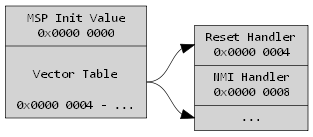
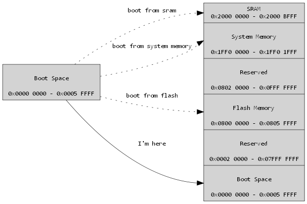
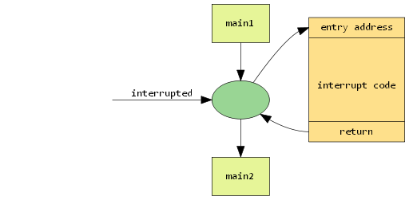
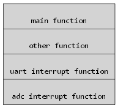
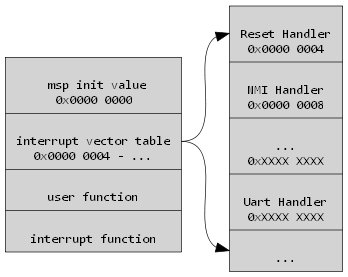

# 嵌入式开发系列教程（二） MCU启动过程

## CortexM3的启动过程
cpu的基本动作是取指，译码，执行，从第一条指令开始执行，循环往复。可是
1. 哪一条指令是第一条指令？
2. 指令都是cpu从存储单元当中取得的，那么第一条指令放置在了哪里？
3. 我们写的代码都烧写到了flash里面，代码从main函数开始运行，那么main函数的地址是不是第一条指令？

对于CortexM3来讲，他的启动过程是这样的

1. 从`0x0000 0000`地址处取出MSP的初始值
2. 从`0x0000 0004`地址处取得PC指针初始值，然后执行用户代码。
3. `Vector Table`指的是中断向量表，`Reset Handler`指的是复位向量。从图中我们看出`Reset Handler`不过是`0x0000 0004`地址的一个别名，他其中放置的便是CPU上电后要执行的第一条用户代码指令的地址。将这个值加载到PC指针上，cpu跳转执行用户代码。

直观上来讲，CPU应是从0地址去取第一条指令，而这条指令总是一个跳转指令，跳转到用户代码，但M3并不符合直觉。

## stm32f103的启动过程
`stm32f103`作为一个M3核心的单片机，他符合我们上边讲的规则。不过st做了一些扩展

- `Boot Space`是对一段内存空间的别名，根据不同的启动条件，映射到不同的存储设备上，但是访问地址一定是`0x0000 0000 - 0x0005 FFFF`这个区间
- 当从SRAM启动时，`Boot Space`映射到SRAM上，即`0x0000 0000`和`0x2000 0000`两个地址是指的同一块空间
- 当从Flash启动时，`Boot Space`映射到Flash上
- 当从System Memory启动（即bootloader）时，`Boot Space`映射到st公司保留的System Memory上，这是一段ROM，烧写有st的bootloader代码

以上，假设单片机从flash启动，则
- 从`0x0000 0000 -> 0x08000 0000`地址处取出MSP的初始值
- 从`0x0000 0004 -> 0x08000 0004`地址处取出PC指针初始值，然后执行用户代码

其实现在我们便可以回答一开始提出的三个问题了。然而我们一直提到中断向量表，那么什么是中断向量表，为什么要有中断向量表呢？

## 中断向量
我们先来看一下什么是中断


- 主循环（main)的代码和中断代码都是CPU执行的
- 中断随时可能发生
- CPU在执行主循环指令序列时，如果产生了中断，CPU便会记录当前PC指针，装载中断入口地址，执行中断代码，中断代码执行结束后，手动调用返回指令，CPU便会加载上一次记录的地址（中断前），继续执行原指令序列
- 手动调用返回指令，在单片机C语言编码过程中，编译器已经帮我们做了，我们感觉不到

我们的主循环代码，中断代码都是烧写到了单片机的flash中的。


cpu跳转到中断处理函数，必然要先知道中断处理函数的入口地址。而我们不可能控制主函数的代码长度。这样的话，中断处理函数的入口地址是无法固化的。那么如何让CPU找到正确的中断入口函数呢？corteM3引入了中断向量的概念

- `interrupt vector table`即为中断向量表
- 我们重述一下启动过程
	-  从`0x0000 0000`地址处取出MSP的初始值
	-  从`0x0000 0004`地址处，即中断向量表中第一个元素，复位向量处取得PC指针初始值，然后执行用户代码
	-  复位向量其实就是`0x0000 0004`地址单元，放的就是用户代码首地址
-  当中断发生时，CPU会根据中断号，去中断向量表中找对应的中断入口地址，然后执行中断代码，这样的话，这个表结构，记录了所有的中断入口地址。

```c
__Vectors       DCD     __initial_sp              ; Top of Stack
                DCD     Reset_Handler             ; Reset Handler
                DCD     NMI_Handler               ; NMI Handler
                DCD     HardFault_Handler         ; Hard Fault Handler
                DCD     MemManage_Handler         ; MPU Fault Handler
                DCD     BusFault_Handler          ; Bus Fault Handler
                DCD     UsageFault_Handler        ; Usage Fault Handler
                ...
```

**M3芯片的中断设置比上述文章中要复杂，文章的述说方式，为了方便理解省去了相当一部分内容。**

 *本系列教程其实是对于我个人开发经验的一个总结，希望能够帮到刚刚入门，即将入门的开发者们，这是一个免费，开源的教程，如果你喜欢可以转发，也可以打赏奖励。*


