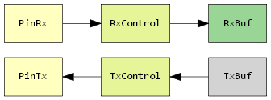
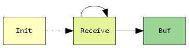
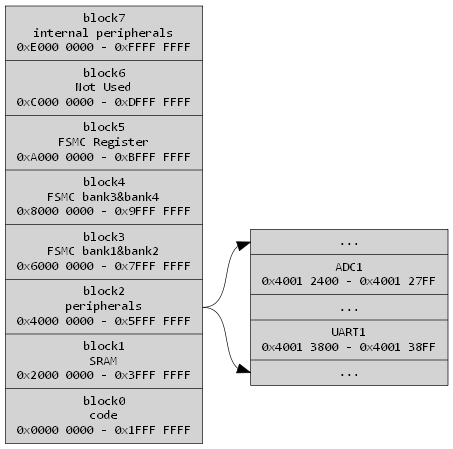
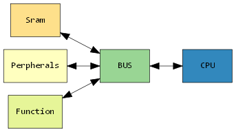

# 嵌入式开发系列教程（一） MCU和外设

## MCU是什么
MCU即单片机指的是把中央处理器、存储器、定时器、各种输入输出接口都集成在一块集成电路芯片上的微型CPU。单片机与通用型CPU不同，通用型CPU如果要工作还需要内存、硬盘、输入输出设备等外接存储单元，而单片机只需要一个时钟发生电路便能正常工作了。
## 外设是什么
一般意义上的外设，指的是单片机的输入输出设备，例如模数转换器，定时器，串口，SPI，GPIO等。
## MCU是怎么控制外设的
串口数据流

- PinRx检测输入的高低电平信号，交给RxControl模块处理
- RxControl模块根据已经设置好的波特率等参数，解析高低电平信号，解析到一个字节后，写入到RxBuf
- RxBuf模块负责和CPU通讯
- TxBuf模块负责和CPU通讯
- TxControl模块从TxBuf处拿到数据，根据已经设置好的波特率等参数，将字节数据转换为比特流
- PinTx 根据TxControl输出的比特流，进行高低电平变化

串口接收

- 串口先初始化，初始化参数从哪里获取？
- 循环接收数据，每接收到一个字节便将其写入Buf缓冲区，通知CPU来取，怎么通知？不取会如何？

可以把串口理解为一个单片机，运行的伪代码如下：
```c
static int  BaudRate = 0;
static char Buf;
void Init(int baudrate)
{
	BaudRate = baudrate;
}

void Receive()
{
	if(BaudRate == 115200){
		...
		Buf = xx;
	}
	else if(BaudRate == 19200){
       ...
       Buf = xx;
	}
    ...
}

void Notice() //通知CPU取数据
{
     ...
}

int main()
{
	Init(115200); 

	while(1){
		Receive();
        Notice(); //通知CPU拿走Buf中的数据
	}
}
```
我们来解答上边提出的问题
- 串口模块上也有RAM单元，只不过容量小，我们这里理解为是可以容纳BaudRate和Buf两个变量的RAM空间
- 串口上的RAM单元，CPU是可以访问的，CPU可以写BaudRate,但只能读Buf。
- 如果CPU不能及时读走Buf的数据，Buf会被覆盖，为了解决这个问题，有的单片机会把Buf做的比较大，做成一个循环缓冲区，stm32就是这么做的，您可以阅读其文档。
- 到这里我们应该明白，cpu核和外设是两个独立的东西，一般情况下CPU核和外设是不同厂家设计的。8051的核是intel设计的，但是at89C51芯片上的串口模块是atmel公司设计的。只不过atmel把CPU核和外设都集成到了一个集成电路上（相当于电脑主板商）。

## 外设的寄存器
外设的寄存器，相当于外设运行所必备的RAM单元。为了能够和CPU通讯，挂载到了CPU的总线上。我们来看一张stm32f103的内存映射图

- 这是 ARM公司cortex-M3核心的CPU。
- 内存已经按照功能分区，block1上，芯片生产厂家只能放置SRAM，block2上只能放置外设，block7是CPU调试核心单元。
- `block2 perpherals`放置的是外设，我们可以看到，adc1和uart1所有的寄存器都落在了block的地址区间。
- `block1 SRAM`放置的是SRAM，我们可以看到，M3核心CPU的SRAM最大是512M，地址区间是`0x2000 0000 - 0x3FFF FFFF`，一般MCU的SRAM都小于512M，但都是低地址对齐（从`0x2000 0000`开始），访问不存在的内存时，会出现`hard fault`。



- cpu你可以理解为cortex-m3核，整个图理解为stm32f103单片机。
- sram一般走高速总线，外设走低速总线，这里为了简便，省略了这些细节。
- 如果你感兴趣，可以阅读cortex-m3和stm32f103的文档，观察一下他们的总线结构。

 /*本系列教程其实是对于我个人开发经验的一个总结，希望能够帮到刚刚入门，即将入门的开发者们，这是一个免费，开源的教程，如果你喜欢可以帮助推广，也可以打赏奖励。*/


 


