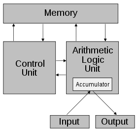
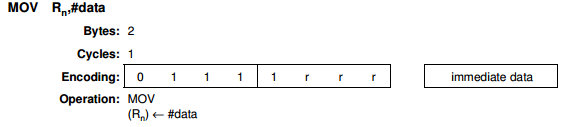
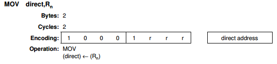
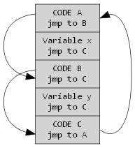
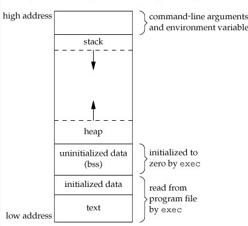
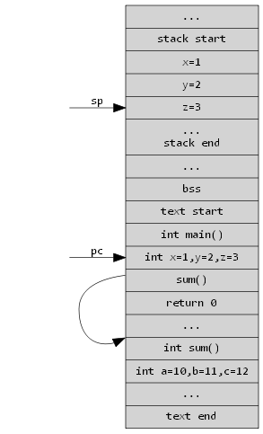
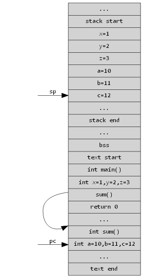
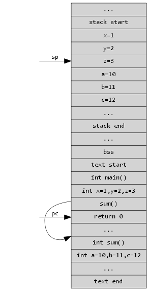

# 嵌入式开发系列教程（三） 单片机的C语言
这里我们主要介C语言运行环境在单片机（MCU）中建立的过程。单片机运行的核心构件是`CPU`,我们通过讨论`CPU`怎么`运行`，`程序员`怎么告诉`CPU`正确`运行`（汇编）,`程序员`怎么更容易的告诉`CPU`正确`运行`（C语言），来进一步明晰C语言运行环境的建立。值得注意的是，计算机是现代工业的产品，C语言也是。C语言和计算机这两大产品，为了适应彼此都做了相当的调整。
## 计算机系统的基本概念


- 冯诺依曼结构CPU取得存储单元中的`程序指令`,译码执行。
- `程序指令`被当成了一种特别的静态数据。
- 将`指令`当成`数据`的概念使得汇编语言，编译器与其他编程工具得以实现。
- 哈佛结构是对冯诺依曼结构的一种改进。

## 汇编
汇编语言使用助记符来代替和表示特定低级机器语言的操作。我们以8051为例，看一个汇编指令
```c
MOV R0,#30H
```

- 图中 `r r r`的位置应填`0 0 0`代表R0,`immediate data` 为`30H`由此我们也看到，mov只能用到R0-R7（111）这几个寄存器。
- 当汇编器看到 `MOV Rn，#data`类似的命令时,会按照图示将其翻译为一个两字节指令。
```c
MOV 40H,R1
```


- 图中 `r r r`的位置应填`0 0 1`代表R1,`direct addres` 为`40H`。
- 虽然同为MOV指令，但是二进制上来看，和上一条指令相比，确是完全不同的两条指令。也就是说通过MOV这个助记符，可以提取同一类动作的指令，方便程序员书写，查看。最后利用汇编器把指令翻译成二进制机器代码。

*51单片机的指令宽度较窄，不是一个很好的例子，大家可以熟悉查看cortexM3的指令集，会有更多收获*
汇编语言非常直接，他就是一些确定的机器代码（CPU指令），对地址（存储器)进行直接操作。我们来看一张汇编代码的内存布局示意图。


- 代码`CODE A、CODE B、CODE C`和变量`variable x` `variable y`是混在一块的，对于单片机来讲，一般将代码放置在flash（ROM）里，`variable x`变量分配的地址如果为flash空间，这个变量便不能被写。这一般不是我们想看到的。也就是说，写汇编代码必须清楚某一段地址空间被映射到了什么存储单元上。
- 假设我们把`CODE A` `CODE B` `CODE C`看成是三个函数。我们知道对于汇编来讲只要label，也就是只要函数地址，那么我们怎么传参数
	- 利用寄存器 R0 R1等。这样的话我们需要确定这几个寄存器是否空闲，不空闲的话，要先将其内容保存，然后再用，函数调用完成后恢复。
	- 指定一个地址空间，也就是说，我们可以假设`variable x`便是需要传的参数，需要传参数时，便把变量值写到`variable x`空间上。
	- 可参数是不固定的，数量不固定，类型也不固定。刚刚那几个办法只是解决了参数才内存中放置的问题。可我们把参数放置在了`variable x` `variable y`内存空间上，用来传递。可去取得时候，我们又需要考虑，这个参数是什么类型的，到底占用了多少内存空间。

我们知道`C语言`良好的解决了上述问题，可他是怎么解决的呢？
## C语言


- 这是unix环境下的c语言内存布局图，不过和单片机的差不太多，图就不另外再画了。
- text是代码段，我们可以看到，已经初始化的数据和代码指令都被放到了代码段
- 未初始化的数据，被放置在了bss段
- 有一个stack空间和一个heap空间，单片机上，我们可以只考虑stack空间
- 图中的high address单片机上完全不用考虑。

C语言中，我们只要申请变量（编译器会根据变量类型分配对应大小的内存空间），写代码就可以了，至于变量和代码会被编译器合理的安排内存空间。如果你想要了解各个段的内存分配情况，可以自行查看工程对应的链接脚本。

我们再来看看栈的活动过程。

```c linenos:true
int sum()
{
	int a=10,b=11,c=12;
	int s = a+b+c;
	return s
}

int main()
{
	int x=1,y=2,z=3;
	sum();
	return 0;
}
```
当代码执行到main函数中 `int x=1，y=2，z=3`这一行时

栈帧向下生长到 `z=3`,栈空间上保存了x,y,z三个变量，代码执行到pc指针处。
代码执行到sum函数中`int a=10,b=11,c=12`这一行时

栈帧向下生长到`c=12`,栈空间保存了x,y,z a,b,c六个变量。
当代码执行到main函数中`return 0`这一行时

栈帧回退，这样存储a，b，c三个变量的空间可以被重复利用

也就是说，栈帧其实是编译器帮我们维护的一段内存空间。当我们需要的时候便会分配给我们一段，不需要的时候（函数执行完），便会将内存回收，以便其他地方使用，而如果我们用汇编编程，需要手动做这些操作，非常麻烦，得不偿失。

图示中，故意避开了参数传递动作，对于RISC的CPU来说，参数传递一般依赖Rn寄存器，我们可以看编译器手册确定。也就是说，C语言编译器自动生成一些代码保存 Rn --> 使用Rn传递参数 -->跳转到指定函数 --> 执行完毕 -->取Rn原值，返回。类似这种代码。**你可以仔细思考下当用栈传递参数时，栈帧结构是怎么变化的**

## 单片机C环境的建立
其实这个问题回答起来很简单，单片机C运行环境，便是将栈，代码段，bss段，各个段内存布局做好，这个代码一般在对应的start.S中，然后，跳转到main函数执行。但是其中有很多细节，你如果有兴趣的话，可查看相应代码。

 *本系列教程其实是对于我个人开发经验的一个总结，希望能够帮到刚刚入门，即将入门的开发者们，这是一个免费，开源的教程，如果你喜欢可以转发，也可以打赏奖励。*


